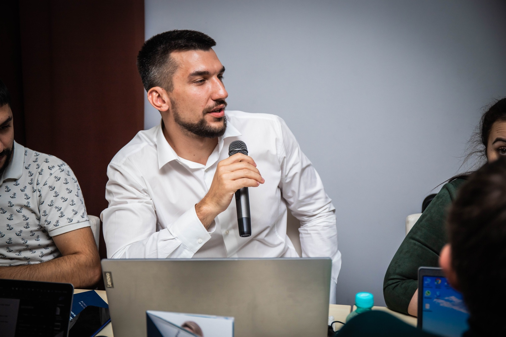

# Gribanov German Igorevich

******

## Briefly About Myself:

 I worked at a federal company for 7 years at **<https://globaldrive.ru/>**. In the beginning, I was a salesperson and by the end, I had 7 stores under my control with around 55 personnel. After that, I chose to change my location and **decided to become a Front-End developer** because I can see the results of my work immediately and, most importantly, my location won't affect my ability to do my job. All I need is an **internet** connection. After gaining some experience as a developer, I want to have a big team and together we can do interesting and new things in the industry or explore new territories with our company.

******

## Code example:

```
//my life cycle
while ($me.isAlive()) {
  $me.eat();
  $me.sleep();
  $me;code();
}
```

## Skills

HTML5: [SkillBox](https://skillbox.ru/course/frontend-developer/)

CSS3:  [SkillBox](https://skillbox.ru/course/frontend-developer/)

People management

Hiring

    + Communication
    + Sales
    + Advertising promotion

## Languages

Russian (Native)

[English (B1)](https://learnenglish.britishcouncil.org/english-levels/online-english-level-test)


## About

```
const german = {
    * Age: 29,
    * Born: 'Russia, Khabarovsk',
    * Live: 'Fethiye (Turkey) since 10 November 2022y'
}
```

## Contacts
Phone: [7-914-151-79-89](https://api.whatsapp.com/send?phone=79141517989)


    Mail: germangribanov@mail.ru
    Discord: Герман#8151
    GitHub: GermanGrib


**Best regards. Thank you for reading.**
